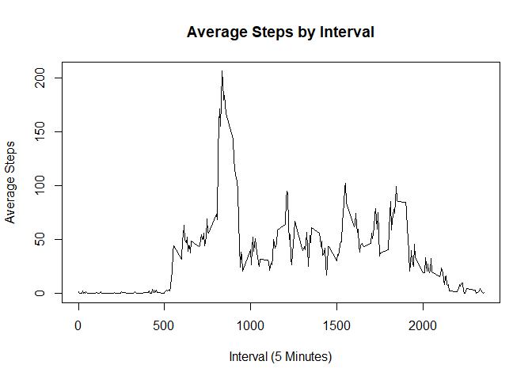

## Loading and preprocessing the data


```r
activity <- read.csv("activity.csv",na.strings = "NA")
```


## What is mean total number of steps taken per day?

```r
library(dplyr)
```

```
## 
## Attaching package: 'dplyr'
```

```
## The following objects are masked from 'package:stats':
## 
##     filter, lag
```

```
## The following objects are masked from 'package:base':
## 
##     intersect, setdiff, setequal, union
```

```r
activity %>% group_by(date) %>% summarise(steps = sum(steps, na.rm = T)) -> steps_by_day
hist(steps_by_day$steps, main = "Steps taken in a day", xlab = "Steps")
```

<!-- -->

```r
sprintf("Mean steps: %s", format(mean(steps_by_day$steps), nsmall = 2))
```

```
## [1] "Mean steps: 9354.23"
```

```r
sprintf("Median steps: %s", median(steps_by_day$steps))
```

```
## [1] "Median steps: 10395"
```

## What is the average daily activity pattern?

```r
activity %>% group_by(interval) %>% summarise(meansteps = mean(steps, na.rm = T)) -> steps_by_interval
plot(steps_by_interval$interval, steps_by_interval$meansteps, type = "l",
     main = "Average Steps by Interval", xlab = "Interval (5 Minutes)", ylab = "Average Steps")
```

<!-- -->

```r
sprintf("Maximum number of average steps is %s in the interval %s", format(max(steps_by_interval$meansteps)
        ,nsmall = 2 ),steps_by_interval[which.max(steps_by_interval$meansteps),"interval"])
```

```
## [1] "Maximum number of average steps is 206.1698 in the interval 835"
```

## Imputing missing values

```r
sprintf("The number of NAs is: %s", format(sum(is.na(activity$steps)), nsmall = 2) )
```

```
## [1] "The number of NAs is: 2304"
```
The average number of steps overall will be imputed into the null values

```r
activity_imp <- activity
activity_imp[is.na(activity_imp$steps),"steps"] <- mean(activity$steps, na.rm = T)
```


```r
activity_imp %>% group_by(date) %>% summarise(steps = sum(steps, na.rm = T)) -> steps_by_day_imp
hist(steps_by_day_imp$steps, main = "Steps taken in a day", xlab = "Steps")
```

<!-- -->

```r
sprintf("Mean steps: %s", format(mean(steps_by_day_imp$steps), nsmall = 2))
```

```
## [1] "Mean steps: 10766.19"
```

```r
sprintf("Median steps: %s", format(median(steps_by_day_imp$steps), nsmall = 2))
```

```
## [1] "Median steps: 10766.19"
```

Due to the method of imputation used the median is now the imputed value. The mean remains the same as it was what was used as the imputed value.

## Are there differences in activity patterns between weekdays and weekends?


```r
library(lubridate)
```

```
## 
## Attaching package: 'lubridate'
```

```
## The following object is masked from 'package:base':
## 
##     date
```

```r
activity_imp$date <- ymd(activity_imp$date)
activity_imp$weekday <- as.factor(ifelse(weekdays(activity_imp$date,T) %in% c("Sat","Sun"),"weekend","weekday"))
```


```r
library(lattice)
activity_imp %>% group_by(interval,weekday) %>% summarise(steps = sum(steps, na.rm = T)) -> steps_by_interval_imp
steps_by_interval_imp$weekday <- as.factor(steps_by_interval_imp$weekday)
xyplot(steps~interval|weekday ,data= steps_by_interval_imp, type="l", layout = c(1,2))
```

<!-- -->
